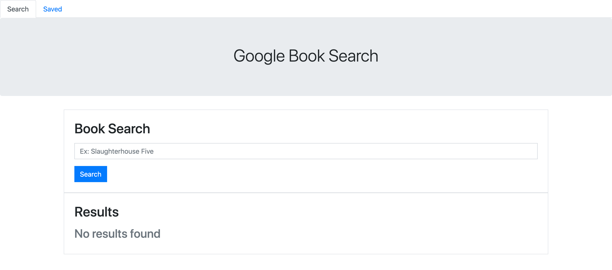

# Google-Books-Search

-------------------------------------------------- Personal Notes -------------------------------------------------

Deployed Link: https://eddiephi-google-books-search.herokuapp.com/ 

Description:
I developed an application that searches through the Google Books API and saves individual entries.

Screenshot:

Technologies: HTML, CSS, JavaScript, MongoDB, Express, React, Node.js

License: MIT

I used https://validator.w3.org/nu/ to validate my work.

---------------------------------------------------- Contact ----------------------------------------------------

Email: ephimansone@gmail.com 

LinkedIn: https://linkedin.com/in/eddiephi

GitHub: https://github.com/EddiePhi

Portfolio: https://eddiephi.github.io/EddiePhiPortfolio/